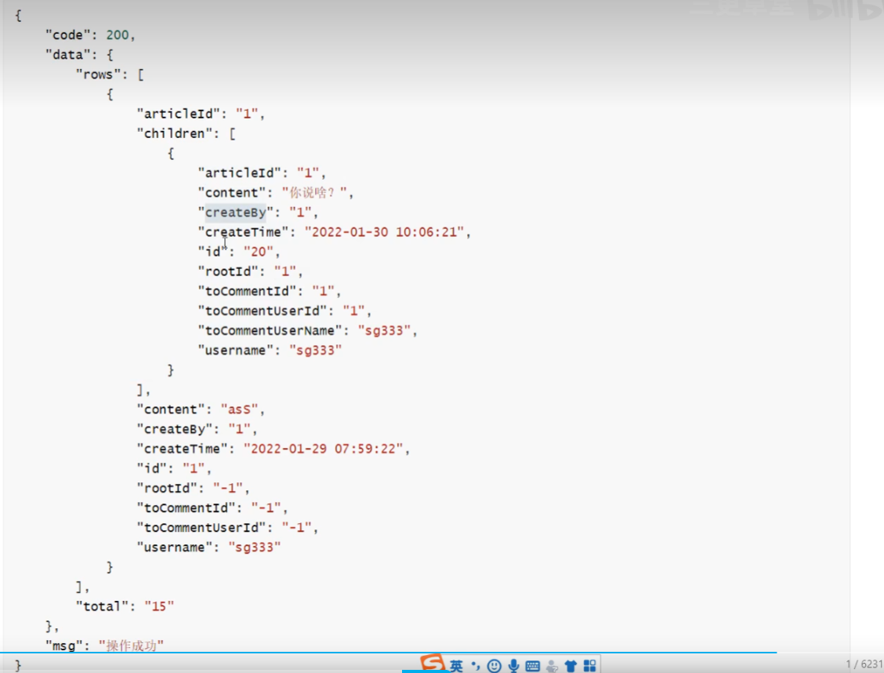

## 8/9

学到p12

- 理解模块开发
- 使用Easycode快速创建实体
- 简单运行Vue前端

## 8/10

### Get请求

?name=..&age=.. 这种可以直接接收 
/1 需要就加上 @PathVariable  
封装在body里面 加上 @RequestBody

> 如果我们使用到了分页操作，最终用beanutils封装vo时，源数据应该在page.records里面

- 我们使用Stream流
- categories象征着一个class集合 categories.stream().filter可以筛选处里面自定义条件的实体
- 如果我们想把当前实体list的一个属性拿出来用到另一张表中查询,可以用categories.stream().map

> 在本serviceimpl中,可以直接list查询表中所有条,list(wrapper) 查询满足要求的条数
> 如果想用其他表的list 或者getbyid ,可以先@autowired service

今日完结 p31

## 8/11

今天学下函数式编程以及springsecurity框架

## 8/13

花了两天时间学了一下 security框架 以及stream流,今天继续学blog 登录实现
> 登录实现

1. 首先写一个loginimpl实现类 ,类里我们需要注入第三方bean`AuthenticationManager`(系统不会自动注入)
   我们需要创建一个SecurityConfig在里面配置.这个配置类有许多权限的配置,不要放在公共模块里面
2. 我们实现类可以用securityManager的bean对象了,先在`UsernamePasswordAuthenticationToken`输入前端传过来的用户名和密码,
   `Authentication authenticate = authenticationManager.authenticate(authenticationToken);`会调用DetailService 相关操作
   于是我们写`UserDetailServiceImpl`,重写方法`loadUserByUsername`根据用户名获取用户,顾名思义.
3. 在实现类`UserDetailServiceImpl`中我们使用usermapper获取user对象,但不能直接返回user,因为方法返回值需要一个`UserDetails`类型,
   `UserDetails`是一个接口,我们定义一个LoginUser去实现`UserDetails`接口就可以了
4. ok,detailimpl写完后继续回到主线,返回一个`authenticate.getPrincipal()`,本质上就是一个LoginUser对象,我们
   可以强转.强转成loginuser对象以后获取其成员属性user的id,使用jwt工具类将其变成token(本质就是加密).
5. 用redis存储,key是bloglogin:id,value是loginUser实体对象
6. 返回响应 响应是`BlogUserLoginVo`对象,两个属性一个是token(id结果jwt加密),一个是userinfo(loginuser的浓缩版)
7. 登录功能完成了,如果发送请求需要携带token意味着他需要登录才能访问
   **终于知道为什么运行不了了 SecurityConfig 里面还要允许`/login`请求**

> 添加过滤器

- 写一个过滤器,继承`OncePerRequestFilter`,重写dofilterinternal方法.感觉都是固定写法,写完filter后我们需要将它添加到securityconfig里面

> 添加一个异常处理器

- 我们发送请求有异常,如果不配置没提示信息,我们可以在handler中配置
- 在handler.security里面加上两个异常处理实现,这里说一说`WebUtils.renderString`作用,是将ResultJson对象转换成
  json字符串返回给前端.我们用postman测试返回一个json,其实是返回给前端页面的东西

> 异常统一处理

- 定义一个异常 `SystemException`,里面包含异常的code以及msg
- 实际上我们抛异常直接传一个Systemexception(enum) 枚举对象就行了
- 异常处理,获取异常code msg,包装成resultjson的形式返回前端

**这两个都是异常处理:我的理解是第二种异常处理就是我们平时理解的异常处理,我定义异常我处理异常, 我还是返回ResultJson.第一种异常更像是security暴露给我们的接口,我们按他的要求实现就行了**

> 退出登录

退出登录主要是删除redis里面存储的用户信息

1. 定义logout实现类
2. 我们可以通过holdercontext来获取Loginuser对象,然后获取对应id在reids里面删除即可

---
> 小细节

配完登录与注册以后我出现前端页面各种小bug,我们打开SecurityConfig需要授权的请求我们单独设置 ,其他请求我们全部permitAll(),这样主页就可以显示出来了.另外我们需要取消系统默认的注销方式,也是在sc里面配置

### 8/15

花了一天处理python,今天接着看

评论比较复杂,因为涉及父评论子评论之类的,以下是返回给前端的Json格式

未登录的用户可以查看别人评论,但是发起评论必须要登录

### 8/16

`List<Comment> list = list(commentLambdaQueryWrapper) `可以返回满足lamda表达式的 list集合,如果你希望查出来的结果要做分页操作的话,不要使用`List()`,使用`page`
包装后 用`get`
返回集合
> 显示父评论

- 评论分了根评论和子评论,根评论直接在文章下面,没有X回复X这样的形式.
- 我们首先查出所有的根评论 `rootid=-1`即为根评论.
- 不管是父评论还是子评论都需要知道这评论是谁发的，子评论还需要额外添加发给谁
  `tocommentid`和`tocommentname`应该是针对子评论,可以显示X回复X

> 显示子评论 直接根据父评论的children显示出来就行了

> 发表评论
>
发表评论分为在文章下发表评论(发表父评论或者子评论)以及在友链上发表评论

我们希望每次发表评论 MP自动帮我们添加 comment表中的`updatetime`等等,引入工具类
`handler.mybatisplus.java`以及`utils.SecurityUtils`

我在securityconfig并没有给发布评论设置权限,但是不登录无法发表评论,应该是前端设置过

